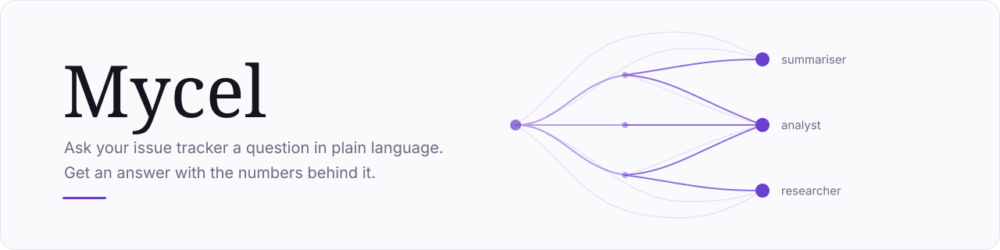
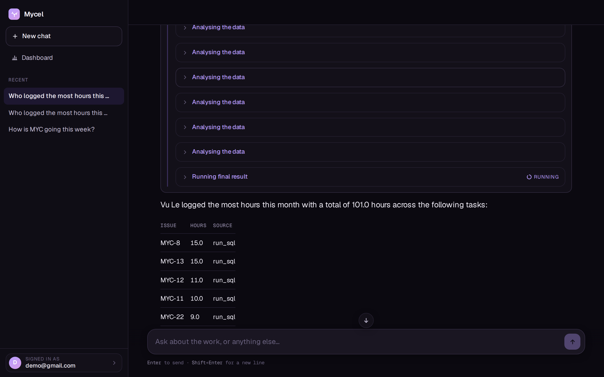
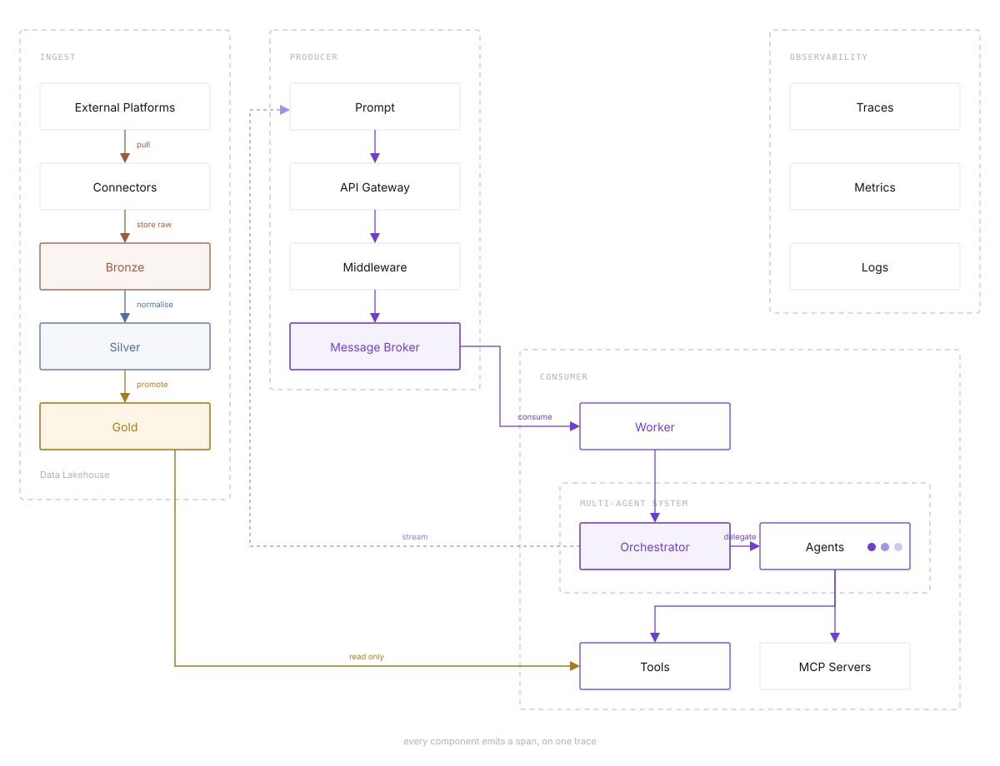

<div align="center">

<picture>
  <source media="(prefers-color-scheme: dark)" srcset="assets/banner-dark.svg">
  
</picture>

<p>
  
  <a href="https://github.com/vuzlee/mycel/actions/workflows/ci.yml"></a>
  
  
</p>

</div>

Named after *mycelium* — the underground fungal network that quietly connects a whole
forest, moving nutrients between trees that never touch. Mycel works the same way: it runs
in the background, pulls what moved in Jira, digests it through layer after layer, and only
surfaces when you ask it something. The interesting part was never the fruiting body.

## What it looks like

You ask in a sentence. Mycel picks the agents and tools it needs, runs them, and answers
with the figures it used — so every number can be traced back to the query that produced it.

<a href="assets/demo.webm">
  
</a>

<sup>A real session, recorded. <a href="assets/demo.webm">Play it</a> — 78 seconds.</sup>

## How it is put together

Connectors land external platforms in a bronze, silver and gold lakehouse. A question goes
over the API onto a broker; a worker picks it up and an orchestrator delegates to agents
that read gold. Traces, metrics and logs run alongside the whole path.

<picture>
  <source media="(prefers-color-scheme: dark)" srcset="assets/flow-dark.svg">
  
</picture>

Today the source is Jira; the source layer is pluggable. Reports go out over Telegram and
Google Calendar — both optional, both one-way. Mycel never writes to your board.

## Quickstart

```bash
cp .env.example .env      # fill in DB and API keys
scripts/stack.sh up       # containers, migrations, api, worker, scheduler
```

One command, idempotent: starts what is down, leaves what is up, applies migrations, and
waits until each service answers a real query rather than merely accepting TCP.

The containers are `docker compose up -d postgres redis rabbitmq`. The API, the worker and
the scheduler are not: they run on the host under `uv run`, so an edit is picked up without
a rebuild. To run them in containers the way prod does, `docker compose --profile app up -d`
and skip this script.

| | |
|---|---|
| UI | http://localhost:8000/app — sign in at `/app/login` |
| API | http://localhost:8000 |
| Postgres | **5433**, so it cannot collide with a system install |

```bash
scripts/stack.sh status      # what is running, where
scripts/stack.sh logs api    # follow api · worker · scheduler
scripts/stack.sh sync        # one Jira sync now, don't wait for the tick
scripts/stack.sh restart     # pick up a code change
scripts/stack.sh down        # stop; named volumes keep the data
```

All three host processes matter: no worker means `POST /reports` hands back a job id nobody
picks up; no scheduler means nothing syncs until you run `sync` by hand.

New Jira project? `scripts/tools/seed_jira.py` fills it with this repo's own history, so the first
sync doesn't read an empty board.

## Config

Secrets and per-machine settings live in `.env` (see `.env.example`). Everything versioned —
environments, agents, sources — is YAML under `config/`.

| | |
|---|---|
| `DATABASE_URL` · `RABBITMQ_URL` · `REDIS_URL` | the three services |
| `ANTHROPIC_API_KEY` · `GEMINI_API_KEY` | a run needs the key its model spec asks for, and no other |
| `JOB_CEILING_USD` | spend ceiling for one queued job |
| `TELEGRAM_*` · Google Calendar creds | outputs; leave blank and they're simply off |

Access is a row in `app.membership`: no row, no project, so a new account starts with
nothing rather than with everything. Grant it from the account menu in the app — anyone who
may read a project may share it.

`scripts/stack.sh grants` splits the database into two roles once, after the migrations:
`mycel_etl` writes bronze, silver and gold; `mycel_app` reads gold and owns `app`. It is a
separate step rather than a migration because a role cannot take privileges from itself.

## What you can ask it

- **"How is PROJ doing this sprint?"** — `summariser` returns a verdict (on track · at risk ·
  off track), a headline, then the tables behind them: at risk, in flight, shipped, and
  estimated against spent per person.
- **"Who logged the most hours on bugs last month?"** — `analyst` writes its own SQL against
  gold and returns each figure with the query that produced it.
- **"Any release notes from our vendor about this?"** — `researcher` searches the web and
  reads the mailbox over IMAP, headers only.
- **A report every Monday morning** — `POST /reports/summary` has no page in front of it; it
  is what a cron calls, and what sends Telegram and Calendar.

Two things are true by construction, not by prompt: `run_sql` runs inside
`SET TRANSACTION READ ONLY`, so a question that would change work data is refused by
Postgres itself; and effort curves come from worklogs, never resolution dates, because Jira
stamps a resolution with the moment of the API call and a back-filled project would draw a
confident, false line.

## Developing

```bash
uv run ruff check .          # lint
uv run mypy                  # strict, src/ only
uv run alembic upgrade head  # migrations apply
uv run pytest --cov          # with a coverage floor
```

The four steps CI runs, in that order — cheapest first. Tests that need Postgres, RabbitMQ
or Redis skip without them; the rest run straight after `uv sync`. Two guards in
`tests/conftest.py` make the suite safe anywhere: the DSN must end in `_test`, and
`ALLOW_MODEL_REQUESTS = False` turns any real provider call into an error.

Evals are not tests — tests catch broken code, evals catch a report that has no error and is
simply worse than last time. See [evals/](evals/README.md).

## Where things are

```
src/mycel/     Source — one folder per layer
web/           React + TypeScript, built into the image, served at /app
config/        Per-environment, per-agent and per-source YAML
migrations/    Alembic migrations, plus the grants split
deploy/        OTel, Grafana, Helm, vLLM, deploy environments
evals/         Golden set for scoring report quality
docs/          Design documentation
assets/        Banner and diagram as hand-written SVG; the demo as a recording
```

| | |
|---|---|
| **[docs/architecture.html](docs/architecture.html)** | How the system is put together — read this first |
| **[docs/using-mycel.html](docs/using-mycel.html)** | Sign up, connect Jira, read the report |
| [docs/database.html](docs/database.html) | Schemas, tables, every column, with diagrams |
| [deploy/envs/](deploy/envs/README.md) | Environment variables, staging and prod |
| [deploy/inference/](deploy/inference/README.md) | Hardware constraints for the local model |
