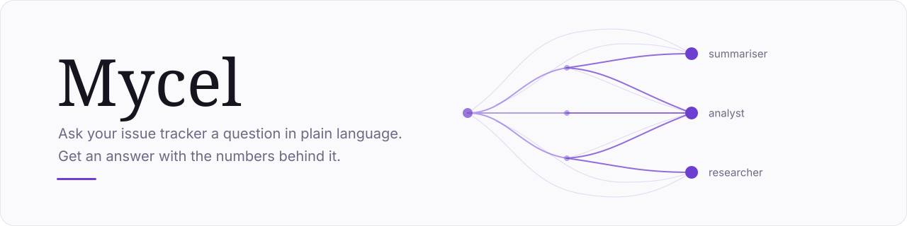

<div align="center">

<picture>
  <source media="(prefers-color-scheme: dark)" srcset="assets/banner-dark.svg">
  
</picture>

<p>
  
  <a href="https://github.com/vuzlee/mycel/actions/workflows/ci.yml"></a>
  
  
  <a href="LICENSE"></a>
</p>

</div>

Named after *mycelium* — the underground fungal network that quietly connects a whole
forest, moving nutrients between trees that never touch. Mycel works the same way: it runs
in the background, pulls what moved in Jira, digests it through layer after layer, and only
surfaces when you ask it something. The interesting part was never the fruiting body.

## What it looks like

You ask in a sentence. Mycel picks the agents and tools it needs, runs them, and answers
with the figures it used — so every number can be traced back to the query that produced it.

https://github.com/user-attachments/assets/c8546f73-e6a8-4aca-abb1-08c07a849eb0

<sup>A real session, 95 seconds, nothing staged.</sup>

## How it is put together

Connectors land external platforms in a bronze, silver and gold lakehouse. A question goes
over the API onto a broker; a worker picks it up and an orchestrator delegates to agents
that read gold. Traces, metrics and logs run alongside the whole path.

<picture>
  <source media="(prefers-color-scheme: dark)" srcset="assets/flow-dark.svg">
  
</picture>

Today the source is Jira; the source layer is pluggable. Mycel never writes to your board.
It does read and write your own Google Calendar, on consent you give per account and can
revoke — and only after reading a booking back to you for a yes.

## What it is, and what it is not

**An internal tool you host yourself.** One team, one Jira board, one machine — a laptop, a
spare box, a VM nobody else reaches.

| | |
|---|---|
| One person, alone? | yes |
| A team? | yes — `app.membership` scopes every read by project |
| Facing the internet? | **no** |

The third answer is the one worth reading twice, because several deliberate choices only
make sense behind a wall: registration is open until you set an invite code, Grafana has no
login, and one Jira token serves the whole deployment. Each is right for a team that
already trusts each other and wrong in front of a public URL.

**It is not a SaaS and is not becoming one.** There is no tenant id, no isolation between
organisations, no per-customer accounting — adding them is not a feature, it is a different
data layer. Said here because the alternative is somebody finding out by deploying it.

## Quickstart

```bash
cp .env.example .env      # four lines to fill in; the rest already works
scripts/stack.sh doctor   # says what is missing and what each absence costs
scripts/stack.sh dev up   # containers, migrations, api, worker, scheduler
```

`doctor` runs before anything is configured, which is the point of it: it tells a **broken**
thing apart from one that is **off on purpose**, and from outside those look identical.

```
STORES
  ok    postgres       connected, 13 tables
SOURCES
  FAIL  jira           JIRA_API_TOKEN is not set — the dashboard will be empty
SEARCH
  off   qdrant         not configured — rag_search is not offered to the model
REGISTRATION
  FAIL  who may sign up  ANYONE who can reach the URL — set REGISTRATION_INVITE_CODE
```

**Configuration is split by one rule**: what must never reach git lives in `.env`, and
everything else lives in `config/environments/`, which *is* committed. Changing an interval
becomes a commit with a history rather than a silent edit on one machine. An environment
variable always wins over both.

One command, idempotent: starts what is down, leaves what is up, applies migrations, and
waits until each service answers a real query rather than merely accepting TCP.

| | |
|---|---|
| UI | http://localhost:8000/app — sign in at `/app/login` |
| API | http://localhost:8000 |
| Postgres | **5433**, so it cannot collide with a system install |

```bash
scripts/stack.sh dev status      # what is running, where
scripts/stack.sh dev logs api    # follow api · worker · scheduler
scripts/stack.sh dev down        # stop; named volumes keep the data
scripts/stack.sh sync            # one Jira sync now, don't wait for the tick
```

### Three ways to run it

The application is the same in all three; what differs is where it runs.

| | Where the app runs | Use it for |
|---|---|---|
| `dev` | on the host under `uv run`, stores in compose | writing code — an edit needs no rebuild |
| `compose` | in containers, running the image | checking the image CI builds |
| `k8s` | the chart on minikube, stores still in compose | checking the chart deploys |

```bash
scripts/stack.sh compose up monitoring   # image in containers, + Prometheus/Loki/Grafana
scripts/stack.sh k8s build               # build and load the image into minikube
scripts/stack.sh k8s up monitoring       # the chart, seven pods
scripts/stack.sh k8s down --all          # uninstall, stop minikube, stop the stores
```

**The stores never move.** Postgres, RabbitMQ and Redis run in compose in every mode,
including `k8s` — a StatefulSet with a volume claim is the painful part of Kubernetes and
proves nothing the chart is meant to prove. The pods reach them at
`host.minikube.internal`, because inside a pod `localhost` is that pod.

All three host processes matter: no worker means `POST /reports` hands back a job id nobody
picks up; no scheduler means nothing syncs until you run `sync` by hand.

New Jira project? `scripts/tools/seed_jira.py` fills it with this repo's own history, so the first
sync doesn't read an empty board.

## Config

Secrets and per-machine settings live in `.env` (see `.env.example`). Everything versioned —
environments, agents, sources — is YAML under `config/`.

| | |
|---|---|
| `DATABASE_URL` · `RABBITMQ_URL` · `REDIS_URL` | the three services |
| `GEMINI_API_KEYS` | comma-separated — each key is its own account, so three keys are three free tiers |
| `JOB_CEILING_USD` | spend ceiling for one queued job |
| `GOOGLE_CLIENT_ID` · `GOOGLE_CLIENT_SECRET` · `GOOGLE_TOKEN_KEY` | the calendar; leave blank and it's simply off |
| `QDRANT_URL` | search over tracked work; blank and the tool is never offered. Embeddings run on this machine, so there is no bill |

Access is a row in `app.membership`: no row, no project, so a new account starts with
nothing rather than with everything. Grant it from the account menu in the app — anyone who
may read a project may share it.

**A fresh deployment has to grant the first one from a shell.** Sharing needs somebody who
can already read the project, and on a new database nobody can read anything:

```bash
uv run python scripts/tools/grant_project.py              # who has what
uv run python scripts/tools/grant_project.py you@example.com PROJ
```

That rule reaches the model too. `analyst` writes its own SQL, and gold is behind a
row-level security policy scoped to whoever asked — a query that names a project they were
not granted returns no rows rather than an error, which is also the refusal that gives away
nothing about what exists.

`scripts/stack.sh grants` splits the database into two roles once, after the migrations:
`mycel_etl` writes bronze, silver and gold; `mycel_app` reads gold and owns `app`. It is a
separate step rather than a migration because a role cannot take privileges from itself.

## What you can ask it

- **"How is PROJ doing this sprint?"** — `summariser` returns a verdict (on track · at risk ·
  off track), a headline, then the tables behind them: at risk, in flight, shipped, and
  estimated against spent per person.
- **"Who logged the most hours on bugs last month?"** — `analyst` writes its own SQL against
  gold and returns each figure with the query that produced it.
- **"Any release notes from our vendor about this?"** — `researcher` searches the web and
  reads the mailbox over IMAP, headers only.
- **"What have I got this afternoon?"** — `researcher` reads your own calendar and answers
  with each event's link.
- **"Book the review, 3pm tomorrow, half an hour"** — it reads the time back in words and
  books nothing until you agree.

Two things are true by construction, not by prompt: `run_sql` runs inside
`SET TRANSACTION READ ONLY`, so a question that would change work data is refused by
Postgres itself; and effort curves come from worklogs, never resolution dates, because Jira
stamps a resolution with the moment of the API call and a back-filled project would draw a
confident, false line.

## Developing

```bash
uv run ruff check .          # lint
uv run mypy                  # strict, src/ only
uv run alembic upgrade head  # migrations apply
uv run pytest --cov          # with a coverage floor
```

The four steps CI runs, in that order — cheapest first. Tests that need Postgres, RabbitMQ
or Redis skip without them; the rest run straight after `uv sync`. Two guards in
`tests/conftest.py` make the suite safe anywhere: the DSN must end in `_test`, and
`ALLOW_MODEL_REQUESTS = False` turns any real provider call into an error.

Evals are not tests — tests catch broken code, evals catch a report that has no error and is
simply worse than last time. See [evals/](evals/README.md).

## Where things are

```
src/mycel/     Source — one folder per layer
web/           React + TypeScript, built into the image, served at /app
config/        Per-environment, per-agent and per-source YAML
migrations/    Alembic migrations, plus the grants split
deploy/        OTel, Grafana, Helm, vLLM, deploy environments
evals/         Golden set for scoring report quality
docs/          Design documentation
assets/        Banner and diagram, hand-written SVG
```

| | |
|---|---|
| **[docs/architecture.html](docs/architecture.html)** | How the system is put together — read this first |
| **[docs/using-mycel.html](docs/using-mycel.html)** | Sign up, connect Jira, read the report |
| [docs/database.html](docs/database.html) | Schemas, tables, every column, with diagrams |
| [deploy/envs/](deploy/envs/README.md) | Environment variables, staging and prod |
| [deploy/inference/](deploy/inference/README.md) | Hardware constraints for the local model |
